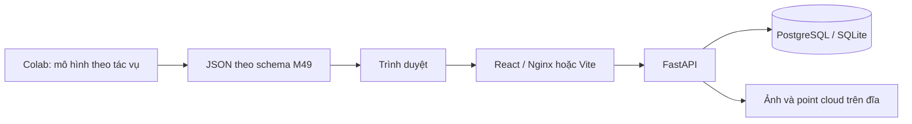

# Kiến trúc

Một dự án chỉ có một tác vụ. Tạo ba dự án khi chạy cả ba tác vụ; điều này tránh gộp điểm 2D/mask/3D không tương đương.

- `Project`: tên, task, danh sách lớp.
- `Asset`: tên gốc duy nhất trong dự án, đường dẫn lưu UUID, kích thước ảnh hoặc point cloud.
- `LabelSet`: một bản chụp nhãn bất biến theo API hiện tại; nguồn `ground_truth`, `ai`, `manual`, `assisted`.
- `assisted.parent_id`: bắt buộc trỏ đến một LabelSet nguồn AI của cùng dự án.
- `payload`: bundle có thể gồm một hoặc nhiều mẫu; một bản mới không ghi đè bản cũ.

- `Experiment`: khóa ID ground truth, danh sách asset và ngưỡng IoU. Không có endpoint thay đổi cấu hình sau tạo.
- `Assignment`: một người, một mẫu và một chế độ trong thử nghiệm; draft_id và final_id trỏ vào snapshot LabelSet. Có unique constraint theo experiment/asset/annotator/mode.
- `AnnotationEvent`: save/resume/pause/finalize, revision và timestamp server. Chưa ghi từng thao tác hình học.
- Ghi draft/chốt/timer dùng compare-and-swap revision trong cùng giao dịch; yêu cầu cũ bị từ chối 409. Draft tạo snapshot mới, không ghi đè AI.
- Endpoint editor chỉ trả asset, assignment và objects từ draft/final/AI parent; không trả ground truth payload.
- Evaluator chấm bản người đã chốt và từng AI run theo mẫu đã khóa; phân biệt kết quả thiếu với nhãn rỗng. CSV có GT ID, ngưỡng, label-set ID và missing policy.

Frontend dùng React và SVG cho box/polygon, Canvas 2D để chiếu point cloud và cuboid LiDAR; không thêm dependency. History reducer dùng chung ba tác vụ. Draft autosave có debounce 900 ms; chuyển tab/dự án bị chặn khi còn thay đổi, đang lưu hoặc timer chạy.

Timer đo các khoảng resume/pause bằng timestamp server. Người dùng cần tạm dừng trước khi đóng trang: chưa có heartbeat hoặc idle detection, nên crash/đóng cưỡng bức có thể làm khoảng thời gian tiếp tục tăng. Các chức năng mới chưa được chạy test/build theo yêu cầu người dùng.

Lưu trữ file và database chưa có giao dịch phân tán. API xóa file khi ghi database thất bại; chưa có tác vụ quét file mồ côi sau crash. Đây là điểm cần hoàn thiện khi triển khai thật.

Ground truth tách theo source và không được nạp vào editor; API chưa xác thực/phân quyền. Cần vai trò reviewer/admin và annotator trước khi thu thập kết quả mù nhiều người.

Khởi tạo database vẫn dùng create_all để tạo các bảng chưa tồn tại, không cập nhật schema bảng cũ. Thay đổi này thêm bảng mà không đổi cột ở Project/Asset/LabelSet. Alembic và kiểm tra nâng cấp trên bản sao dữ liệu còn trong ROADMAP; không xóa database đang có dữ liệu để thay migration.
