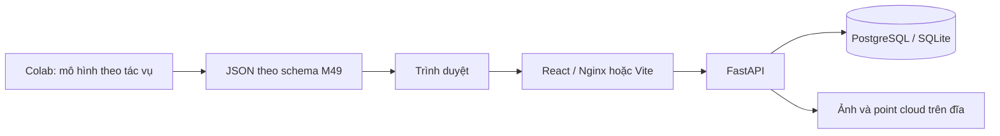

# Kiến trúc

Một dự án chỉ có một tác vụ. Tạo ba dự án khi chạy cả ba tác vụ; điều này tránh gộp điểm 2D/mask/3D không tương đương.

- `Project`: tên, task, danh sách lớp.
- `Asset`: tên gốc duy nhất trong dự án, đường dẫn lưu UUID, kích thước ảnh hoặc point cloud.
- `LabelSet`: một bản chụp nhãn bất biến theo API hiện tại; nguồn `ground_truth`, `ai`, `manual`, `assisted`.
- `assisted.parent_id`: bắt buộc trỏ đến một LabelSet nguồn AI của cùng dự án.
- `payload`: bundle có thể gồm một hoặc nhiều mẫu; một bản mới không ghi đè bản cũ.

Hiện chưa tự chọn phiên bản cuối khi tổng hợp: cần thêm đối tượng Experiment/Assignment trước khi xây evaluator, nhằm xác định đúng bộ nhãn nào được chấm.

Lưu trữ file và database chưa có giao dịch phân tán. API xóa file khi ghi database thất bại; chưa có tác vụ quét file mồ côi sau crash. Đây là điểm cần hoàn thiện khi triển khai thật.

Ground truth tách theo source và không được nạp vào editor; API chưa xác thực/phân quyền. Cần vai trò reviewer/admin và annotator trước khi thu thập kết quả mù nhiều người.

Khởi tạo database dùng create_all, không cập nhật schema cũ. Khi thay đổi model, bổ sung Alembic; không xóa database đang có dữ liệu để thay cho migration.
